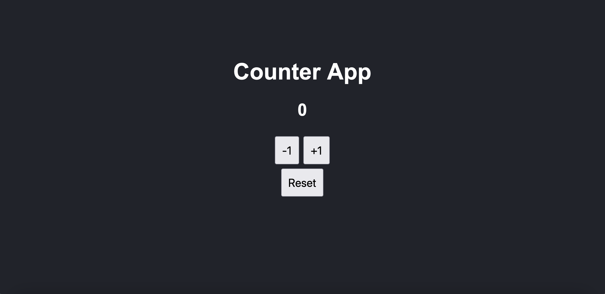

# Counter App with Vite

A simple counter application built with **React** and **Vite**. This app allows users to increment, decrement, and reset a counter value. The application is responsive and adapts to different screen sizes.

## Demo



## Features

- Increment and decrement the counter value.
- Reset the counter to zero.
- Prevent the counter from decreasing below zero.
- Responsive design for different screen sizes.

## Technologies Used

- [React](https://reactjs.org/) ^18.3.1
- [Vite](https://vitejs.dev/) ^5.4.1
- [JavaScript (ES6+)](https://developer.mozilla.org/en-US/docs/Web/JavaScript)
- [CSS3](https://developer.mozilla.org/en-US/docs/Web/CSS)

## Getting Started

### Prerequisites

Make sure you have the following installed:

- **Node.js**: You need Node.js installed along with npm. You can download it [here](https://nodejs.org/).

### Installation

1. **Clone the Repository**

   ```bash
   git clone https://github.com/your-username/counter-app-vite.git
   ```

2. **Navigate to the Project Directory\***
   ```
   cd counter-app-vite
   ```
3. **_ npm install _**
   ```
   npm install
   ```

### Running the App

To start the app in development mode:

```
npm run dev
```

After running this command, you should see something like this in your terminal:

```VITE v5.4.1  ready in X ms

➜  Local:   http://localhost:5173/
➜  Network: use --host to expose
```

Open http://localhost:5173/ in your browser to view the app.

### Available Scripts

In the project directory, you can run:

- `npm run dev:` Starts the development server using Vite.
- `npm run build:` Builds the app for production in the dist folder.
- `npm run preview:` Serves the production build locally.
- `npm run lint:` Runs ESLint to check for code quality issues.

### How It Works

#### Components

`CounterApp.jsx`
This is the main component that handles the counter logic and UI.

```
import React, { useState } from "react";
import "./index.css";

function CounterApp() {
const [value, setValue] = useState(0);

const handleAdd = () => {
setValue((prevValue) => prevValue + 1);
};

const handleSubtract = () => {
setValue((prevValue) => (prevValue > 0 ? prevValue - 1 : 0));
};

const handleReset = () => {
setValue(0);
};

return (
<div className="container">
<h1>Counter App</h1>
<h2>{value}</h2>
<div className="button-group">
<button onClick={handleSubtract}>-1</button>
<button onClick={handleAdd}>+1</button>
<button onClick={handleReset}>Reset</button>
</div>
</div>
);
}

export default CounterApp;
```

### State Management

- `useState hook:` Manages the state of the counter value.

#### Handler Functions:

- `handleAdd:` Increments the counter.
- `handleSubtract:` Decrements the counter, ensuring it doesn't go below zero.
- `handleReset:` Resets the counter to zero.
